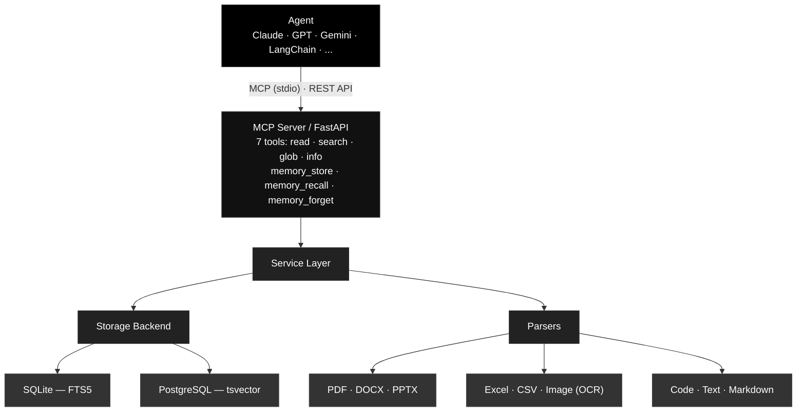

# OpenDB Architecture

## System Overview



## Directory Structure

```
opendb/                  Public CLI + Python API
  cli.py                 init, index, search, read, serve-mcp, serve
  __init__.py            Re-exports Workspace as OpenDB

opendb_core/             Core library (backend-agnostic)
  config.py              Pydantic settings
  database.py            asyncpg pool manager
  workspace.py           High-level Workspace API (embedded mode)
  parsers/               Format-specific extractors
    registry.py          MIME → parser mapping
    pdf.py, docx.py, pptx.py, spreadsheet.py, image.py, text.py
  services/              Stateless business logic
    ingest_service.py    File receive → parse → persist pipeline
    index_service.py     Directory scan + batch ingest (incremental)
    read_service.py      File text extraction, line ranges, grep
    search_service.py    FTS query interface
    memory_service.py    Store/recall/forget with FTS + time-decay
    grep_service.py      Regex search with per-file timeout
    vision_service.py    LLM image description (OpenRouter) + Tesseract fallback
    watch_service.py     OS-native file system monitoring
  storage/               Pluggable backends
    base.py              StorageBackend Protocol
    shared.py            Common helpers (highlight, filters, row converters)
    sqlite.py            aiosqlite + FTS5 (embedded, zero-config)
    postgres.py          asyncpg + tsvector (server, multi-user)
  middleware/
    auth.py              Optional API key authentication
  routers/               HTTP endpoints
    read.py, search.py, memory.py, glob.py, info.py
  utils/
    tokenizer.py         CJK segmentation (jieba, pluggable)
    text.py              Line numbering, paragraph chunking
    hashing.py           SHA256 checksum

app/                     FastAPI server entry point
  main.py                Lifespan, middleware, router registration
  config.py              Server-specific settings
  database.py            Connection pool
  routers/, services/, storage/  Server-specific wrappers

mcp_server/              MCP stdio server
  server.py              FastMCP with 7 tools
  client.py              Calls Workspace or backend methods
  models.py              Pydantic input schemas

opendb_integration/      Integration helpers
```

## Data Flow

### File Ingestion

```
Upload / Index directory
  → MIME detection (python-magic)
  → Parser selection (registry)
  → Parse to pages (format-specific)
  → Compute SHA256 checksum
  → Check duplicates
  → Store: files + pages + file_text + FTS index
  → For PG: also store jieba-tokenized text (text_jieba)
```

### Search

```
Query arrives
  → Detect CJK characters in query
  → If CJK:
       SQLite: jieba tokenize query → FTS5 MATCH
       PG: jieba tokenize query → to_tsvector('simple', text_jieba)
  → If Latin:
       SQLite: FTS5 MATCH (unicode61)
       PG: plainto_tsquery('english') on stored tsv column
  → Rank by relevance score
  → Return highlights + metadata
```

### Memory Recall

```
Recall query
  → FTS search (same CJK/Latin split as above)
  → Compute combined score:
       score = fts_relevance × 0.5^(age_days / halflife) × pin_boost
  → Sort by score descending
  → Return top-k results
```

## Storage Backends

### SQLite (Embedded)

- Zero-config: creates `.opendb/metadata.db` in workspace
- FTS5 virtual tables (standalone, jieba-tokenized at ingestion)
- WAL mode for concurrent reads
- Best for: local agents, single-user, CJK-heavy workloads

### PostgreSQL (Server)

- asyncpg connection pooling
- Stored TSVECTOR (`english` config) for Latin text
- Separate `text_jieba` / `content_jieba` columns for CJK
- GIN indexes on both tsvector and jieba columns
- pg_trgm for fuzzy filename matching
- Best for: multi-user, production deployments

## Authentication

Optional API key auth via `FILEDB_AUTH_API_KEY` env var. When set:
- All requests require `X-API-Key` header
- `/` and `/health` endpoints are exempt
- Uses constant-time comparison (`hmac.compare_digest`)

## Configuration

All settings use `FILEDB_` env prefix:

| Variable | Default | Description |
|----------|---------|-------------|
| `FILEDB_BACKEND` | `postgres` | Storage backend (`sqlite` or `postgres`) |
| `FILEDB_DATABASE_URL` | `postgresql://...` | PostgreSQL connection string |
| `FILEDB_MEMORY_DECAY_HALFLIFE_DAYS` | `30.0` | Memory recall time-decay half-life |
| `FILEDB_AUTH_API_KEY` | (empty) | API key for authentication |
| `FILEDB_TOKENIZER` | `jieba` | Tokenizer for CJK text |
| `FILEDB_MAX_FILE_SIZE` | 100 MB | Max upload size |
| `FILEDB_OCR_LANGUAGES` | `eng+chi_sim+chi_tra` | Tesseract OCR languages |
